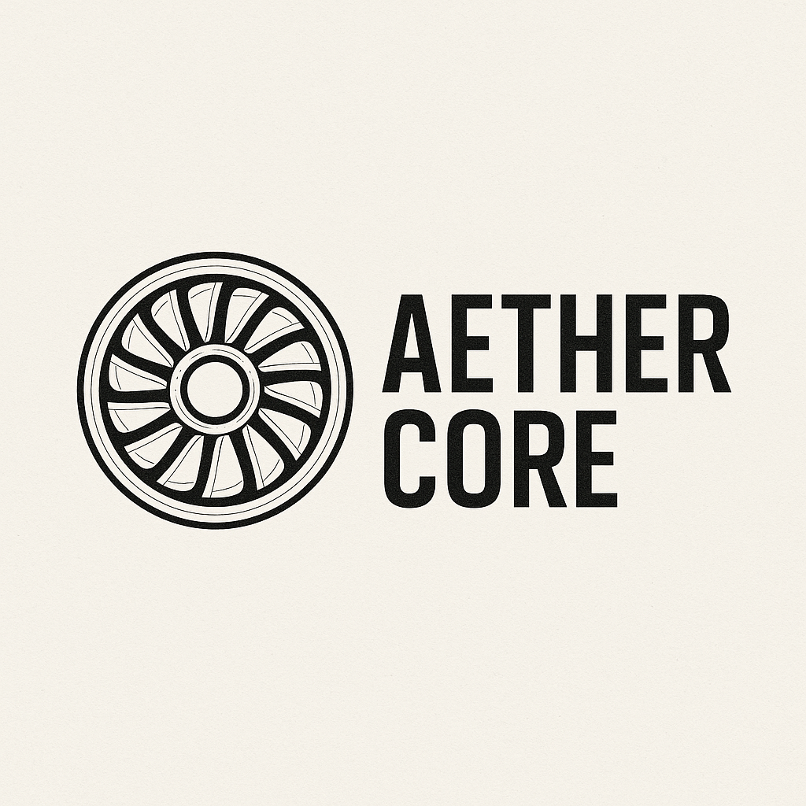

# **Aether Core Engine**  
*A next-generation, low-RPM hybrid-electric turbine engine for small aircraft and motor gliders.*  

 *[Optional: Add your AI-generated logo here]*  

## **?? Key Innovations**  
- **Hollow Hub Design**: Enables airflow entrainment, weight reduction, and multi-mode venting.  
- **Hybrid-Electric Operation**: DFIM with **air-core wireless power transfer** for slip-free energy recovery.  
- **Additive Manufacturing**: Rapidia Tech’s **SLA + freeze-dry sintering** for lightweight, high-strength components.  
- **Soaring-Optimized**: Drag-minimized **energy recovery mode** for motor gliders.  

## **??? Features**  
? **Multi-Mode Venting System**  
- Adapts to flight phases (glide, powered climb, thermal harvesting).  
- Compressor isolation eliminates parasitic drag.  

? **Low-RPM Turbine**  
- Larger blade diameter reduces bearing stress.  
- Magnetic/pneumatic bearing options.  

? **Pilot-Centric UX**  
- Automated mode suggestions + manual override.  

## **?? Repository Structure**  

/docs/
??? GLIDER-USE-CASES.md # Motor-glider integration deep-dive
??? MANUFACTURING.md # Rapidia sintering process
??? SIMULATIONS/ # OpenFOAM/CFD results
/hardware/ # 3D models, actuator specs
/software/ # DFIM control code

## **?? Current Status**  
- **Phase 1**: CFD simulations (OpenFOAM) underway.  
- **Phase 2**: Prototyping louver mechanisms (SLA-ceramic).  

## **?? Use Cases**  
- **Motor Gliders**: Extended cross-country range via thermal harvesting.  
- **Personal Aviation**: Fuel-efficient climb/cruise for 2–8 seat aircraft.  
- **RC Scale**: Low-RPM stability for DIY builders.  

[**Explore Glider Integration ?**](docs/GLIDER-USE-CASES.md)  

---

